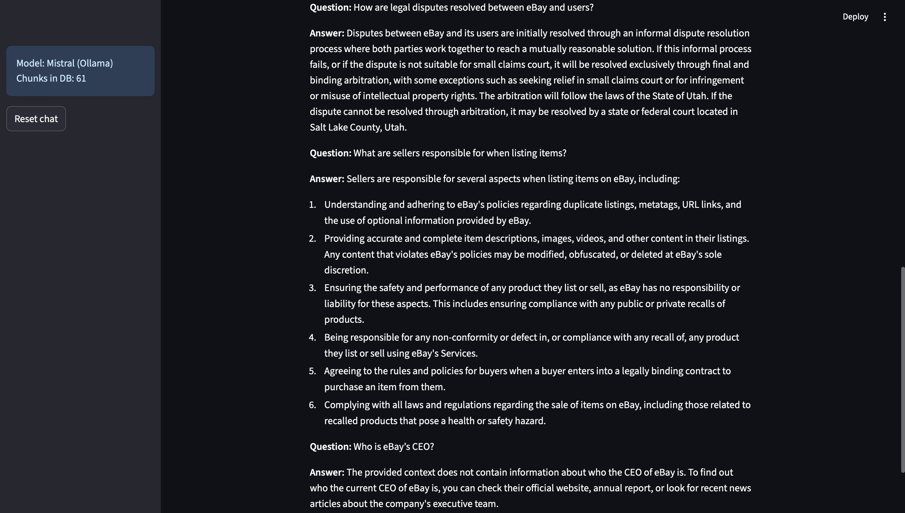

# 📄 RAG Chatbot: Document QA with Streaming LLM Responses

## Overview

This project implements a **Retrieval-Augmented Generation (RAG) chatbot** over a large legal document (e.g., eBay User Agreement), enabling users to ask natural language questions and receive fact-grounded, real-time answers.

The pipeline leverages semantic chunking, fast vector search (FAISS), and a locally-running instruction-tuned LLM (Mistral-7B via Ollama) for efficient and accurate document QA.

---

## 📐 Project Architecture & Flow


graph TD
    A[Document Upload] --> B[Preprocessing and Cleaning]
    B --> C[Sentence-aware Chunking]
    C --> D[Embedding with MiniLM]
    D --> E[Vector DB: FAISS]
    E --> F[Chat Interface: Streamlit]
    F --> G[User Query -> Retrieve Chunks]
    G --> H[Prompt LLM (Mistral via Ollama)]
    H --> I[Streamed, Grounded Answer]


**Pipeline Steps:**

- **Preprocessing:** Clean text, remove formatting, split into overlapping, sentence-aligned chunks.
- **Embedding:** Generate semantic vector for each chunk using `all-MiniLM-L6-v2`.
- **Vector DB:** Store chunk vectors in FAISS for fast similarity search.
- **Retrieval + Generation:** At query time, select top chunks, inject into prompt, and generate a streaming response with local LLM via Ollama.
- **User Interface:** Streamlit app with live response, chunk sourcing, sidebar info, and chat history.

---

## 🛠️ Setup & Running the Project Locally

1. **Install Python dependencies:**

   ```bash
   pip install -r requirements.txt
   python -m nltk.downloader punkt
   ```

2. **Install Ollama for LLM inference:**

   - Download from [ollama.com/download](https://ollama.com/download) and install for your OS.

3. **Download the Mistral model:**

   ```bash
   ollama pull mistral
   ```

4. **Place your document in the **`data`** folder:**

   ```bash
   data/AI_Training_Document.txt
   ```

5. **Preprocess and embed the document:**

   ```bash
   python src/chunk_document.py
   python src/embed_and_index.py
   ```

   *Or run:*

   ```bash
   jupyter notebook notebooks/01_preprocessing_and_embedding.ipynb
   ```

6. **Start Ollama for LLM serving:**

   ```bash
   ollama run mistral
   ```

7. **Start the Streamlit Chatbot:**

   ```bash
   streamlit run app.py
   ```

   Visit [http://localhost:8501](http://localhost:8501) in your browser.

---

## 🤖 Model & Embedding Choices

- **Embedding Model:** `all-MiniLM-L6-v2` (Sentence Transformers)
- **Vector Database:** FAISS (IndexFlatIP; cosine similarity)
- **LLM:** Mistral-7B-Instruct (via Ollama)
- **Prompt Design:** Constrains answers to only use retrieved chunks to minimize hallucination.

---

## 🗂️ Project Structure

```
├── app.py               # Streamlit Chatbot Interface
├── data/                # Folder for input documents
├── notebooks/           # Jupyter notebooks for EDA and preprocessing
├── src/
│   ├── chunk_document.py
│   ├── embed_and_index.py
├── requirements.txt
└── README.md
```

---

## 🧑‍💻 Sample Queries & Screenshots

| Query                                   | AI Response (Excerpt)                    |
| --------------------------------------- | ---------------------------------------- |
| How are legal disputes resolved?        | "Legal disputes are resolved through..." |
| What are sellers responsible for?       | "Sellers must ensure listed items..."    |
| Who is eBay's CEO? *(Known Limitation)* | May fail if outside document scope       |


---

## 🚦 Notes: Hallucination, Limitations, Performance

- **Control:** Prompt forces answers grounded only in retrieved chunks.
- **Limitations:** Answers only based on uploaded document; incomplete context may affect accuracy.
- **Performance:** Efficient with local inference, fast vector retrieval; scalable with FAISS tuning.


